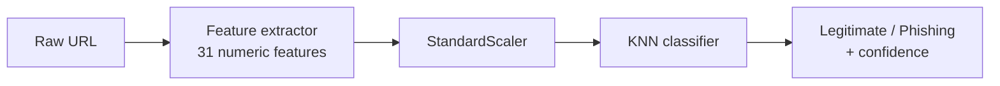

# 🛡️ Phishing URL Detector

**Classify any URL as legitimate or phishing in milliseconds — using only the URL text.**
No page downloads, no WHOIS lookups, no paid APIs.


[](https://github.com/Farhanillahiclass/phishing-url-detector/actions/workflows/tests.yml)


---

## 📌 Overview

Phishing links imitate trusted websites to steal passwords and payment details.
This project detects them from the **structure of the URL string alone**, which makes
predictions instant, private and free to run.

| | |
|---|---|
| **Task** | Binary classification — legitimate vs. phishing |
| **Input** | One raw URL string |
| **Output** | Predicted class + confidence score |
| **Deployed model** | K-Nearest Neighbours (k = 11, distance-weighted) |
| **Interface** | Streamlit dashboard (single URL + batch CSV) |
| **Quality checks** | 28 automated tests, GitHub Actions CI, input validation |

## 🏆 Results

Evaluated on a held-out test set (20% split) from the Hannousse & Yahiouche dataset.

| Metric | Score |
|---|---|
| Accuracy | **0.878** |
| Precision | 0.879 |
| Recall | 0.878 |
| F1-score | **0.878** |
| ROC-AUC | **0.945** |

Confusion matrix (KNN, test set):

|  | Predicted legitimate | Predicted phishing |
|---|---|---|
| **Actual legitimate** | 1005 | 138 |
| **Actual phishing** | 140 | 1003 |

### Example predictions

| URL | Prediction | Phishing probability |
|---|---|---|
| `https://www.google.com/search?q=hello` | ✅ Legitimate | 0.00 |
| `https://github.com/Farhanillahiclass` | ✅ Legitimate | 0.09 |
| `http://paypal-secure-login.xyz/verify/update?id=93af93` | 🚨 Phishing | 0.91 |

## ⚙️ How it works



The same `url_features.py` module is used by **both** training and the app, so the
model never sees features computed differently from how it was trained
(no train/serve mismatch).

### The 31 features

| Group | Examples |
|---|---|
| **Length & size** | URL length, hostname length, number of words, shortest / longest / average word |
| **Special characters** | dots, hyphens, `@`, `?`, `&`, `=`, `_`, `%`, `/`, repeated characters |
| **Host structure** | IP address as host, number of subdomains, abnormal subdomain, `www` in host, port present |
| **Suspicious patterns** | URL shortener, suspicious TLD, `https` token in wrong place, TLD in path, redirection (`//`) |
| **Content hints** | digit ratio (URL and host), phishing keywords such as `login`, `verify`, `secure`, `update` |

## 📊 Data

Three public datasets are used, each for a clear purpose:

| Dataset | Rows | Role |
|---|---|---|
| Hannousse & Yahiouche (2021) | 11,430 | **Primary** — contains raw URLs, used to train the deployed model |
| UCI Phishing Websites (Mohammad et al.) | 11,055 | Cross-dataset benchmark (pre-engineered features) |
| Vrbančič et al. Phishing Dataset | 88,647 | Cross-dataset benchmark (pre-engineered features) |

Only the primary dataset has raw URL text, so it is the only one the custom extractor
can run on. The other two have incompatible feature schemas, so they are benchmarked
separately instead of being merged.

## 🧪 Model comparison

Each model was tuned with 5-fold cross-validated grid search, then evaluated once on the test set.

| Model | CV F1 | Test Acc. | Precision | Recall | F1 | ROC-AUC |
|---|---|---|---|---|---|---|
| Logistic Regression (C = 10) | 0.832 | 0.838 | 0.857 | 0.812 | 0.834 | 0.923 |
| **KNN (k = 11, distance-weighted)** | **0.877** | **0.878** | 0.879 | 0.878 | **0.878** | **0.945** |
| Decision Tree | 0.862 | 0.864 | 0.865 | 0.863 | 0.864 | 0.866 |

KNN was selected for the best F1 and ROC-AUC.

### Cross-dataset benchmark

Same three model families retrained on each dataset's own features.

| Dataset | Best model | Accuracy | F1 | ROC-AUC |
|---|---|---|---|---|
| UCI-30 | Decision Tree | 0.970 | 0.965 | 0.976 |
| Vrbančič-111 | Decision Tree | 0.943 | 0.918 | 0.958 |

These scores are higher because those datasets include domain and page-content
features. The deployed model excludes them on purpose so predictions stay instant
and free of external calls. Full tables are in [`reports/`](reports/).

**Leakage check:** the strongest feature–label correlation is about 0.46 (`nb_www`),
far from the level that would suggest a feature encodes the label.

## 🚀 Quick start

```bash
git clone https://github.com/Farhanillahiclass/phishing-url-detector.git
cd phishing-url-detector
pip install -r requirements.txt
streamlit run src/app.py
```

The trained model is included in `models/`, so the app runs immediately.

### Retrain from scratch (optional)

Raw datasets are not stored in the repo. Download them first:

```bash
mkdir -p data
curl -sL -o data/hannousse_raw.csv  "https://raw.githubusercontent.com/Trieuh2/ml-url-phishing-classifier/main/datasets/raw_dataset.csv"
curl -sL -o data/uci_phishing_30.csv "https://raw.githubusercontent.com/HowWilbert/PhishGuard/main/Network_data/phisingData.csv"
curl -sL -o data/grega_phishing_111.csv "https://raw.githubusercontent.com/GregaVrbancic/Phishing-Dataset/master/dataset_full.csv"

python src/train.py                      # train, tune, evaluate, save model
python src/evaluate_cross_dataset.py     # optional benchmark
```

### The dashboard

- **Single URL check** — paste a URL, get the verdict, confidence and key feature values.
- **Batch check** — paste or upload many URLs, review a results table, download as CSV.
- **About this model** — live metrics of the deployed model.

## ✅ Testing

```bash
pip install -r requirements-dev.txt
pytest tests/ -v
```

28 tests cover the feature extractor (validation, correctness, edge cases) and the
saved model pipeline. The suite runs automatically on every push and pull request
through GitHub Actions on Python 3.10, 3.11 and 3.12.

## 📁 Project structure

```
phishing-url-detector/
├── src/
│   ├── config.py                   # Paths and constants
│   ├── url_features.py             # URL -> 31 features (shared by training and app)
│   ├── train.py                    # Tune, train, evaluate, save
│   ├── evaluate_cross_dataset.py   # Benchmark on two other datasets
│   └── app.py                      # Streamlit dashboard
├── tests/                          # Unit + integration tests
├── notebooks/01_eda_and_models.ipynb   # EDA and model comparison
├── models/                         # Saved model, scaler, metadata
├── reports/                        # Metrics tables (JSON / CSV / MD)
├── .github/workflows/tests.yml     # CI pipeline
├── requirements.txt
├── requirements-dev.txt
└── LICENSE
```

## ⚠️ Limitations

- Uses URL structure only. A phishing URL that closely copies a legitimate structure can evade detection.
- Trained on a 2021 dataset, so periodic retraining is advisable as phishing tactics change.
- KNN keeps the full training set in memory. This is fine at this scale but not for very large datasets.
- Educational prototype — not a replacement for a production security product.

## 🗺️ Roadmap

- [ ] Add optional domain-age and DNS features
- [ ] Retrain on a newer dataset (e.g. PhiUSIIL)
- [ ] Try character n-grams and tree ensembles (Random Forest, XGBoost)
- [ ] Tune the decision threshold to favour phishing recall
- [ ] Add SHAP explanations to the app
- [ ] Deploy publicly on Streamlit Community Cloud

## 🧰 Tech stack

Python · pandas · NumPy · scikit-learn · joblib · Streamlit · matplotlib · seaborn · Jupyter · pytest · GitHub Actions

## 📚 Data sources

- Hannousse, A. & Yahiouche, S. (2021). *Towards benchmark datasets for machine learning based website phishing detection.* Engineering Applications of Artificial Intelligence.
- Mohammad, R. M., Thabtah, F. & McCluskey, L. *Phishing Websites* dataset, UCI Machine Learning Repository.
- Vrbančič, G., Fister, I. Jr. & Podgorelec, V. (2020). *Datasets for phishing websites detection.* Data in Brief.

## 👤 Author

**Muhammad Farhan** — Machine Learning Intern, LearnDepth Academy

Built as the Track 1 capstone project of the LearnDepth Academy Machine Learning Internship.

[LinkedIn](https://www.linkedin.com/in/muhammadfarhanmrs/) · [GitHub](https://github.com/Farhanillahiclass)

## 📄 License

Released under the [MIT License](LICENSE).
